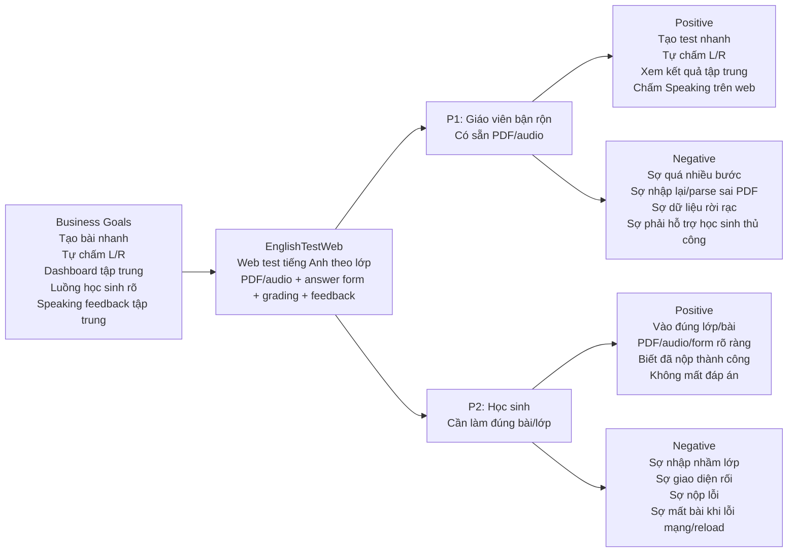

# Trigger Map: EnglishTestWeb

**Ngày tạo:** 2026-06-08  
**Nguồn:** `_bmad-output/A-Product-Brief/project-brief.md` + workshop xác nhận với Đức  
**Phase:** WDS 2 - Trigger Mapping  
**Ngôn ngữ:** Tiếng Việt

---

## 1. Strategic North Star

### Vision

EnglishTestWeb giúp giáo viên tổ chức, chấm và quản lý bài kiểm tra tiếng Anh online trong một quy trình gọn, tập trung, giảm thao tác thủ công nhưng vẫn giữ được cách ra đề quen thuộc bằng PDF/audio.

### Strategic Objectives

1. Giáo viên có thể tạo và publish một bài Reading hoặc Listening từ PDF có sẵn trong dưới 10 phút.
2. Hệ thống tự chấm 100% bài Listening/Reading có answer key khi học sinh nộp bài.
3. Giáo viên xem được kết quả theo lớp, học sinh, bài test và lần nộp trong một dashboard tập trung.
4. Học sinh có thể vào đúng lớp bằng mã lớp, mở bài được giao, làm bài và nộp mà không cần giáo viên hướng dẫn trực tiếp từng bước.
5. Speaking submission, nghe file, nhập điểm và feedback được xử lý trong cùng một màn hình, thay cho việc quản lý file và nhận xét qua nhiều kênh.

### Product/Solution

EnglishTestWeb là web app cho giáo viên giao bài kiểm tra tiếng Anh online theo lớp. MVP tập trung vào Reading, Listening và Speaking:

- Reading/Listening: upload PDF/audio, khai báo answer key, học sinh làm bài qua PDF viewer + answer form, hệ thống tự chấm.
- Speaking: học sinh upload file nói, giáo viên nghe, nhập điểm và feedback thủ công trên web.
- Kết quả được lưu tập trung theo lớp, học sinh, bài test và lần nộp.

---

## 2. Prioritized Target Groups

### Priority 1: Giáo viên bận rộn, đã có sẵn đề PDF/audio

Giáo viên là người tạo bài, giao bài, khai báo đáp án, xem kết quả và chấm Speaking. Nếu giáo viên thấy quy trình nhanh hơn cách cũ, sản phẩm có lý do tồn tại và có khả năng được dùng lặp lại.

**Impact:** High  
**Feasibility:** High  
**Vai trò trong objectives:** Trực tiếp quyết định objectives 1, 2, 3 và 5.

### Priority 2: Học sinh cần làm bài đúng lớp, ít bị rối thao tác

Học sinh là người thực hiện luồng làm bài. Nếu học sinh không vào đúng lớp, không thấy bài, không hiểu cách điền/nộp, giáo viên sẽ phải hỗ trợ thủ công và objective giảm workload sẽ yếu đi.

**Impact:** High  
**Feasibility:** Medium  
**Vai trò trong objectives:** Trực tiếp quyết định objective 4 và gián tiếp hỗ trợ objectives 2, 3.

---

## 3. Persona Details

### Giáo viên bận rộn, đã có sẵn đề PDF/audio

**Who They Are:**  
Giáo viên tiếng Anh đang có sẵn đề kiểm tra ở dạng PDF, đôi khi kèm audio. Họ cần giao bài cho lớp, thu bài, chấm điểm, xem kết quả và xử lý feedback Speaking mà không muốn nhập lại toàn bộ đề.

**Psychological Profile:**  
Họ đề cao **tốc độ, độ tin cậy và sự quen thuộc**. PDF/audio là workflow hiện tại, nên sản phẩm phải tôn trọng cách họ đã chuẩn bị đề. Nếu hệ thống bắt họ chuyển đổi đề sang cấu trúc phức tạp hoặc thao tác quá nhiều, họ sẽ so sánh ngay với cách làm thủ công.

Họ không chỉ cần "tính năng tạo test"; họ cần cảm giác rằng hệ thống đang **giảm việc**, không tạo thêm việc. Điểm tự chấm và dashboard chỉ có giá trị khi việc thiết lập answer key đủ rõ và kết quả đủ dễ xem lại.

**Internal State:**  
Khi nghĩ đến kiểm tra và chấm bài, họ thường ở trạng thái **bận, áp lực thời gian, muốn chắc chắn**. Họ muốn giảm việc lặp lại nhưng vẫn sợ mất kiểm soát nếu hệ thống làm sai hoặc lưu trữ rời rạc.

**Usage Context:**  
Giáo viên thường dùng sản phẩm trên desktop/laptop khi chuẩn bị bài test hoặc sau khi học sinh nộp bài. Họ upload PDF/audio, cấu hình lớp/deadline, nhập answer key, publish bài, rồi quay lại dashboard để xem kết quả và chấm Speaking.

**Relationship to Business Goals:**

- **Tạo bài nhanh:** Là người quyết định bài test có được tạo và publish trong dưới 10 phút hay không.
- **Tự chấm Listening/Reading:** Là người khai báo answer key đúng để hệ thống có thể chấm.
- **Dashboard tập trung:** Là người cần xem kết quả để tránh tổng hợp điểm thủ công.
- **Speaking feedback:** Là người nghe file, nhập điểm và feedback.

### Học sinh cần làm bài đúng lớp, ít bị rối thao tác

**Who They Are:**  
Học sinh được giáo viên giao bài theo lớp. Họ cần nhập mã lớp, đăng nhập, thấy đúng bài được giao, làm bài Reading/Listening/Speaking và nộp đúng hạn.

**Psychological Profile:**  
Họ cần **sự rõ ràng và cảm giác an toàn khi làm bài**. Với Reading/Listening, họ phải vừa theo dõi PDF/audio vừa nhập đáp án vào form riêng, nên layout và trạng thái bài làm phải giúp họ hiểu đang trả lời câu nào và còn thiếu gì.

Họ ít quan tâm đến cấu trúc quản trị phía sau. Điều quan trọng là không bị lạc lớp, không mất đáp án, không nộp nhầm, và có xác nhận rõ khi bài đã nộp.

**Internal State:**  
Khi làm bài, họ có thể **căng thẳng, sợ sai thao tác, sợ mất bài**. Nếu giao diện không rõ, lỗi nhỏ như reload trang, mất mạng hoặc không thấy thông báo nộp bài có thể làm mất niềm tin.

**Usage Context:**  
Học sinh vào web bằng mã lớp, đăng nhập, chọn bài được giao, xem PDF theo trang, nghe audio nếu là Listening, nhập đáp án, nộp bài hoặc upload file Speaking. Họ cần feedback trạng thái rõ trong từng bước.

**Relationship to Business Goals:**

- **Luồng tự làm bài:** Quyết định học sinh có thể làm và nộp mà không cần giáo viên hướng dẫn trực tiếp.
- **Tự chấm:** Submission đúng cấu trúc giúp hệ thống chấm Listening/Reading.
- **Dashboard:** Dữ liệu bài làm đầy đủ giúp giáo viên xem kết quả chính xác.

---

## 4. Driving Forces

### Giáo viên bận rộn, đã có sẵn đề PDF/audio

**Positive drivers**

1. Muốn tạo bài test nhanh từ tài liệu đã có, không phải nhập lại nội dung đề.
2. Muốn hệ thống tự chấm Listening/Reading để giảm thời gian chấm thủ công.
3. Muốn xem kết quả theo lớp/học sinh/bài test ở một nơi duy nhất.
4. Muốn chấm Speaking thuận tiện: nghe file, nhập điểm, ghi feedback ngay trên web.

**Negative drivers**

1. Sợ mất thời gian vì phải thao tác quá nhiều bước khi tạo bài.
2. Sợ hệ thống bắt nhập lại đề hoặc parse PDF sai, làm chậm hơn cách làm cũ.
3. Sợ điểm số, bài nộp, file nói và feedback bị rời rạc qua nhiều kênh.
4. Sợ học sinh không vào đúng bài/lớp, dẫn đến phải hỗ trợ thủ công nhiều.

### Học sinh cần làm bài đúng lớp, ít bị rối thao tác

**Positive drivers**

1. Muốn vào đúng lớp và thấy đúng bài được giao.
2. Muốn xem đề PDF, nghe audio và điền đáp án trong một luồng rõ ràng.
3. Muốn biết bài đã được nộp thành công.
4. Muốn không bị mất đáp án trong lúc làm bài.

**Negative drivers**

1. Sợ nhập nhầm lớp hoặc không thấy bài cần làm.
2. Sợ giao diện làm bài rối: PDF, audio và form đáp án không rõ liên hệ với nhau.
3. Sợ nộp lỗi hoặc không biết đã nộp chưa.
4. Sợ mất bài/đáp án do thao tác nhầm, lỗi mạng hoặc reload trang.

---

## 5. Strategic Prioritization

### Top Driving Forces

1. Giáo viên muốn tạo bài nhanh từ PDF/audio có sẵn, không nhập lại đề.
2. Giáo viên muốn hệ thống tự chấm Listening/Reading và lưu kết quả tập trung.
3. Giáo viên sợ thao tác tạo bài quá nhiều bước hoặc chậm hơn cách cũ.
4. Học sinh muốn vào đúng lớp, thấy đúng bài, làm bài và nộp rõ ràng.
5. Học sinh sợ mất đáp án hoặc không biết bài đã nộp thành công chưa.

### Focus Statement

Thiết kế MVP nên tập trung trước hết vào việc giúp giáo viên tạo, giao và chấm bài test từ PDF/audio có sẵn một cách nhanh, đáng tin cậy, đồng thời đảm bảo học sinh có luồng vào lớp, làm bài và nộp bài rõ ràng để giảm hỗ trợ thủ công cho giáo viên.

---

## 6. Trigger Map Diagram

---

## 7. Gap Analysis

### Strengths

- MVP scope rõ và có ràng buộc thực tế.
- Quyết định PDF/audio + answer form riêng giúp giảm complexity cho phase đầu.
- Giáo viên là primary user rõ ràng, khớp với problem giảm workload.
- Các luồng cốt lõi đã đủ để chuyển sang UX scenarios.

### Gaps / Future Validation

1. Business metrics cần được validate bằng dữ liệu thực tế sau prototype, đặc biệt mốc "tạo Reading/Listening dưới 10 phút".
2. Persona depth hiện dựa trên brief và xác nhận của stakeholder, chưa có user interview.
3. Hành vi học sinh cần được kiểm thử sớm bằng usability test cho luồng mã lớp, answer form, lưu nháp/nộp bài.
4. Dashboard và Speaking feedback cần được giới hạn rõ trong UX scenarios để tránh mở rộng quá mức MVP.

### Alignment Check

Alignment hiện tốt: vision, objectives, target groups, driving forces và MVP features đều xoay quanh cùng một trọng tâm là giảm thao tác thủ công cho giáo viên mà không phá vỡ workflow ra đề bằng PDF/audio.

---

## 8. Design Implications

- Teacher test creation must feel like a short wizard or compact workflow, not a complex form-heavy builder.
- PDF/audio upload should be first-class, visible and trusted; parsing PDF is explicitly out of MVP.
- Answer key setup must be fast, reviewable and easy to correct before publish.
- Student exam screen must keep PDF/audio, answer form, progress and submit state coherent.
- Submission confirmation and answer persistence are core UX requirements, not polish.
- Dashboard should optimize scanning by class, student, test and submission attempt before advanced analytics.
- Speaking review should keep audio player, score input and feedback visible in one focused grading surface.

